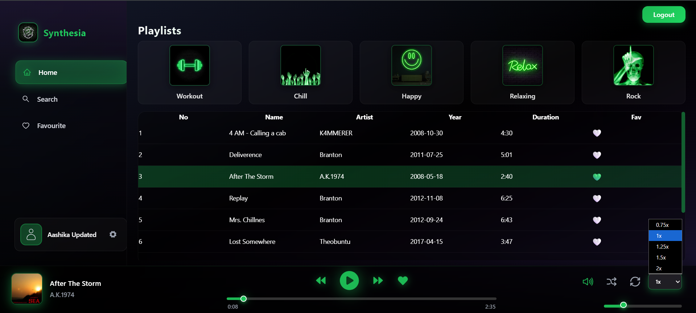
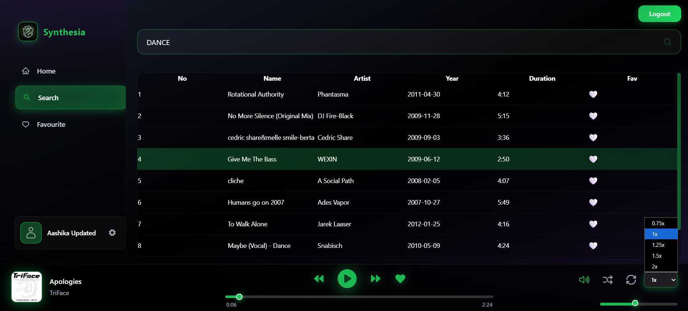
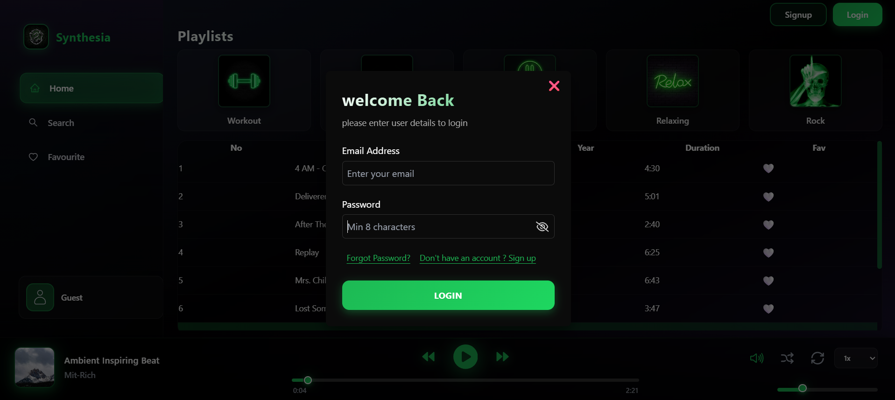
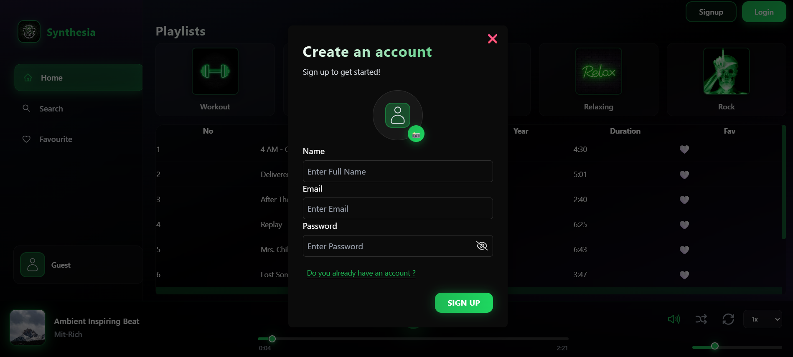
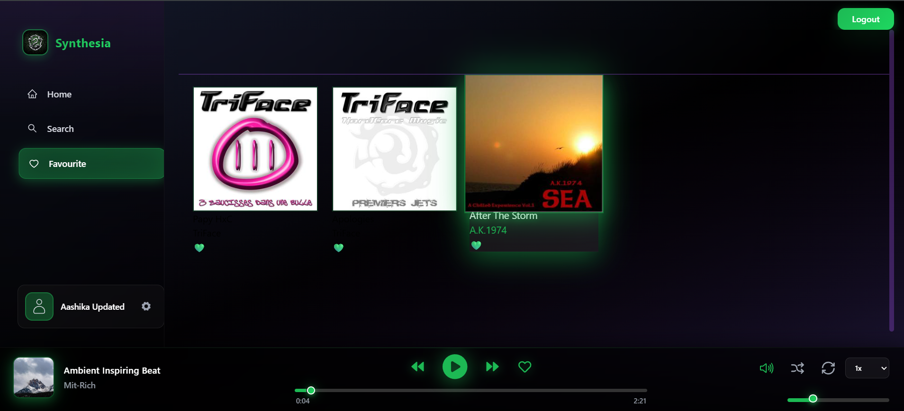

🐍🎧 SYNTHESIA – MERN Music Player

A full-stack music streaming web application built with the MERN Stack (MongoDB, Express, React, Node.js) that allows users to discover, search, and play music seamlessly.

The platform integrates Jamendo API for music streaming, ImageKit for image storage, and Mailtrap for email testing, providing a complete real-world web application architecture.

The UI is inspired by the Slytherin aesthetic, giving the music player a dark, immersive, and stylish interface.

# 🚀 Tech Stack

🎵 Project Overview

SYNTHESIA is a modern web music player designed to demonstrate the power of full-stack development using the MERN stack.

The application allows users to:

Stream music

Search for tracks

Manage favorite songs

Control playback

Interact with a secure authentication system

Music data is fetched dynamically from the Jamendo API, while backend services manage user accounts, favorites, and authentication workflows.

✨ Features
🎧 Music Streaming

Users can stream songs directly within the application using tracks fetched from the Jamendo API.

🔍 Smart Search

Users can search for songs using keywords, and the system instantly displays relevant available tracks.

❤️ Favorite Songs System

Users can like and unlike songs, allowing them to build a personal collection of favorite music.

⭐ Favorites Section

A dedicated Favorites page displays all songs the user has liked.

🔊 Advanced Music Controls

The player includes several playback controls:

Play / Pause

Skip tracks

Adjust volume

Increase or decrease playback speed

🔐 User Authentication

The system includes a full authentication flow:

User Signup

User Login

Forgot Password

Reset Password

Email functionality is tested using Mailtrap.

🎨 Slytherin Inspired Theme

The UI design is inspired by the Slytherin theme, featuring:

Dark aesthetic

Modern layout

Smooth UI interactions

🖼 Image Management

Album artwork and images are efficiently handled using ImageKit, ensuring fast image delivery and optimization.

🧪 API Testing

All backend endpoints were tested and validated using Postman.

📸 Screenshots

🏠 Home Page

🔍 Song Search

🎵 Music Player

💚 Favorite Songs

📂 Project Structure
SYNTHESIA
│
├── client
│ ├── components
│ ├── pages
│ ├── redux
│ └── styles
│
├── server
│ ├── controllers
│ ├── routes
│ ├── models
│ └── config
│
├── package.json
└── README.md

📚 What I have learnt..

This project helped me gain practical experience with:

Building full-stack MERN applications

Integrating external APIs

Implementing authentication systems

Managing application state with Redux

Designing responsive UIs with Tailwind CSS

Testing APIs using Postman

Handling image hosting and email testing services

🔮 Future Improvements

Possible enhancements include:

Playlist creation

Music recommendation system

User profile customization

Dark/Light theme toggle

Music sharing features

👩‍💻 Author

Aashika R

Full Stack Developer | MERN Stack | AI & ML Enthusiast

⭐ Support

If you like this project, please consider starring the repository.
